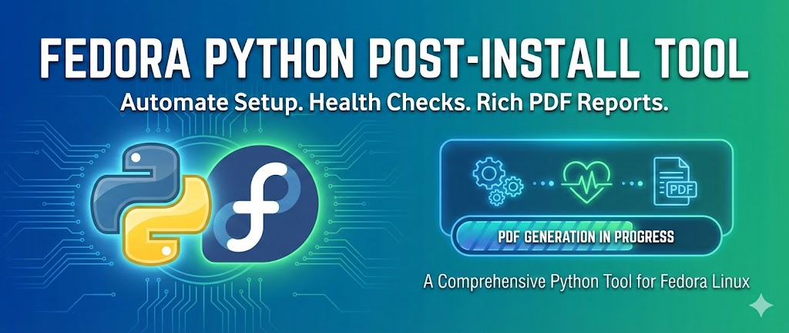

# FedChecker



<p align="center">
  <strong>Fedora Linux Health & Setup Tool</strong><br>
  <em>by sudo3rs</em>
</p>

<p align="center">
  <a href="https://github.com/Masriyan/FedChecks/issues"></a>
  <a href="https://github.com/Masriyan/FedChecks/stargazers"></a>
  <a href="https://github.com/Masriyan/FedChecks/blob/main/LICENSE"></a>
  
  
</p>

---

## Overview

**FedChecker** is a comprehensive command-line tool designed to help Fedora Linux users maintain a healthy system. Whether you're a new user setting up Fedora for the first time or an experienced administrator performing routine maintenance, FedChecker provides an all-in-one solution for:

- System health diagnostics
- Driver detection and configuration
- Security auditing
- Desktop environment optimization
- Post-installation setup automation
- Professional PDF report generation

## Features

### Interactive TUI Menu

Navigate through options using an intuitive terminal interface with keyboard controls:

```
╔══════════════════════════════════════════╗
║     FedChecker - Fedora Health Tool      ║
║              by sudo3rs                  ║
╠══════════════════════════════════════════╣
║  [1] Health Check                        ║
║  [2] Drivers Check                       ║
║  [3] Security Check                      ║
║  [4] Desktop Environment Check           ║
║  [5] Post-Install Setup                  ║
║  [6] Auto-Fix All Issues                 ║
║  [7] Generate PDF Report                 ║
║  [8] Settings                            ║
║  [0] Exit                                ║
╚══════════════════════════════════════════╝
```

### System Health Check

- **Disk Space Analysis** - Monitor usage across all partitions
- **Memory Usage** - RAM and swap utilization tracking
- **CPU Temperature** - Thermal monitoring for overheating prevention
- **Systemd Services** - Detect failed units and service issues
- **Package Integrity** - Verify RPM package consistency
- **Orphaned Packages** - Find and clean unused dependencies

### Driver Detection

- **GPU Drivers** - NVIDIA, AMD, and Intel graphics detection
- **WiFi Drivers** - Wireless adapter status and firmware
- **Audio Drivers** - Sound system configuration check
- **Bluetooth** - Bluetooth adapter and service status
- **Printer Drivers** - CUPS and printer configuration
- **Missing Firmware** - Detect and report missing firmware files

### Security Audit

- **Firewall Status** - firewalld configuration check
- **SELinux Status** - Security policy enforcement verification
- **Failed Logins** - Authentication failure monitoring
- **Open Ports** - Network service exposure scan
- **SSH Configuration** - Secure shell hardening audit
- **Root Account** - Root login and sudo configuration
- **Password Policy** - Password strength requirements check
- **Automatic Updates** - DNF automatic update status

### Desktop Environment Check

- **DE Detection** - GNOME, KDE, XFCE, and other environments
- **Display Server** - X11/Wayland detection
- **Compositor Status** - Window compositor health
- **Theme Integrity** - GTK/Qt theme verification
- **GNOME Extensions** - Extension status and compatibility
- **Missing Dependencies** - Desktop package verification

### Post-Installation Setup

Automate common post-install tasks:

| Feature | Description |
|---------|-------------|
| **DNF Optimization** | Enable fastest mirror, parallel downloads, deltarpm |
| **Repository Setup** | RPM Fusion (free + nonfree), Flathub |
| **Multimedia Codecs** | FFmpeg, GStreamer plugins, VA-API/VDPAU |
| **Development Tools** | Git, GCC, Make, Python dev packages |

### Auto-Fix System

FedChecker can automatically fix detected issues:

- User confirmation before applying any changes
- Detailed logging of all fix actions
- Rollback information where applicable
- Safe, non-destructive operations

### PDF Report Generation

Generate professional reports with:

- Executive summary with overall health score
- System information overview
- Color-coded check results
- Graphical charts (pie charts, bar charts, gauges)
- Prioritized recommendations
- Fix command suggestions

## Installation

### Prerequisites

- Fedora Linux (38 or later recommended)
- Python 3.11 or higher
- pip package manager

### From Source

```bash
# Clone the repository
git clone https://github.com/Masriyan/FedChecks.git
cd FedChecks

# Install dependencies
pip install -r requirements.txt

# Run FedChecker
python run.py
```

### Using pip

```bash
# Install from the repository
pip install git+https://github.com/Masriyan/FedChecks.git

# Run FedChecker
fedchecker
```

### Development Installation

```bash
# Clone and install in editable mode
git clone https://github.com/Masriyan/FedChecks.git
cd FedChecks
pip install -e .
```

## Usage

### Quick Start

```bash
# Run with the launcher script
python run.py

# Or if installed via pip
fedchecker
```

### Navigation

| Key | Action |
|-----|--------|
| `↑` / `↓` | Navigate menu items |
| `Enter` | Select option |
| `1-9` | Quick select menu item |
| `0` / `q` | Exit / Go back |

### Command Line Options

```bash
# Show version
fedchecker --version

# Show help
fedchecker --help
```

## Dependencies

| Package | Purpose |
|---------|---------|
| [rich](https://github.com/Textualize/rich) | Terminal UI, progress bars, tables |
| [reportlab](https://www.reportlab.com/) | PDF generation |
| [matplotlib](https://matplotlib.org/) | Charts and graphs |
| [psutil](https://github.com/giampaolo/psutil) | System information |
| [distro](https://github.com/python-distro/distro) | Linux distribution detection |

## Project Structure

```
FedChecks/
├── fedchecker/
│   ├── __init__.py          # Package initialization
│   ├── main.py               # Main application entry
│   ├── banner.py             # ASCII art banner
│   ├── ui/
│   │   ├── colors.py         # Color definitions
│   │   ├── menu.py           # Interactive menu system
│   │   └── progress.py       # Progress bar animations
│   ├── checks/
│   │   ├── health.py         # System health checks
│   │   ├── drivers.py        # Driver detection
│   │   ├── security.py       # Security audit
│   │   └── desktop.py        # Desktop environment
│   ├── fixes/
│   │   ├── health_fix.py     # Health issue fixes
│   │   ├── driver_fix.py     # Driver fixes
│   │   ├── security_fix.py   # Security fixes
│   │   └── desktop_fix.py    # Desktop fixes
│   ├── postinstall/
│   │   ├── dnf_optimizer.py  # DNF configuration
│   │   ├── repos.py          # Repository setup
│   │   ├── codecs.py         # Multimedia codecs
│   │   └── devtools.py       # Development tools
│   └── reports/
│       ├── generator.py      # PDF report generator
│       ├── charts.py         # Chart generation
│       └── templates.py      # Report templates
├── requirements.txt          # Python dependencies
├── setup.py                  # Package setup
└── run.py                    # Launcher script
```

## Screenshots

### Main Menu
The interactive main menu provides quick access to all features with visual status indicators.

### Health Check Results
Detailed results with pass/fail/warning status for each check, including fix availability.

### PDF Report
Professional reports with charts, color-coded results, and actionable recommendations.

## Contributing

Contributions are welcome! Here's how you can help:

1. **Fork** the repository
2. **Create** a feature branch (`git checkout -b feature/amazing-feature`)
3. **Commit** your changes (`git commit -m 'Add amazing feature'`)
4. **Push** to the branch (`git push origin feature/amazing-feature`)
5. **Open** a Pull Request

### Development Guidelines

- Follow PEP 8 style guidelines
- Add docstrings to new functions and classes
- Update tests for new features
- Keep commits atomic and well-described

## Roadmap

- [ ] Configuration file support
- [ ] Custom check plugins
- [ ] Network diagnostics module
- [ ] Backup and restore functionality
- [ ] Multi-language support
- [ ] Web-based dashboard

## License

This project is licensed under the MIT License - see the [LICENSE](LICENSE) file for details.

## Acknowledgments

- The Fedora Project for an amazing Linux distribution
- [Rich](https://github.com/Textualize/rich) library for beautiful terminal output
- [ReportLab](https://www.reportlab.com/) for PDF generation capabilities
- All contributors and users of FedChecker

## Support

- **Issues**: [GitHub Issues](https://github.com/Masriyan/FedChecks/issues)
- **Discussions**: [GitHub Discussions](https://github.com/Masriyan/FedChecks/discussions)

---

<p align="center">
  Made with love for the Fedora community<br>
  <strong>FedChecker</strong> by sudo3rs
</p>
